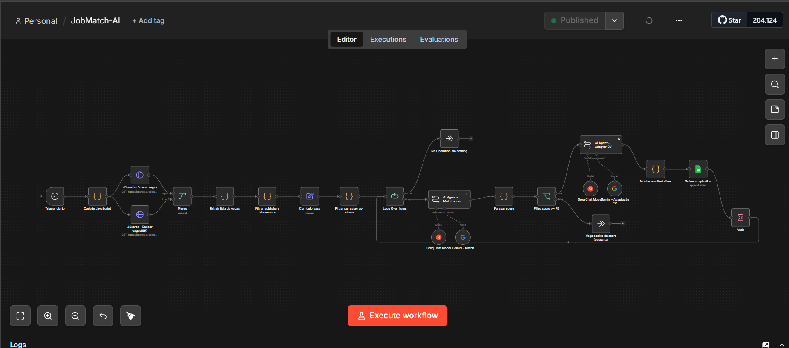
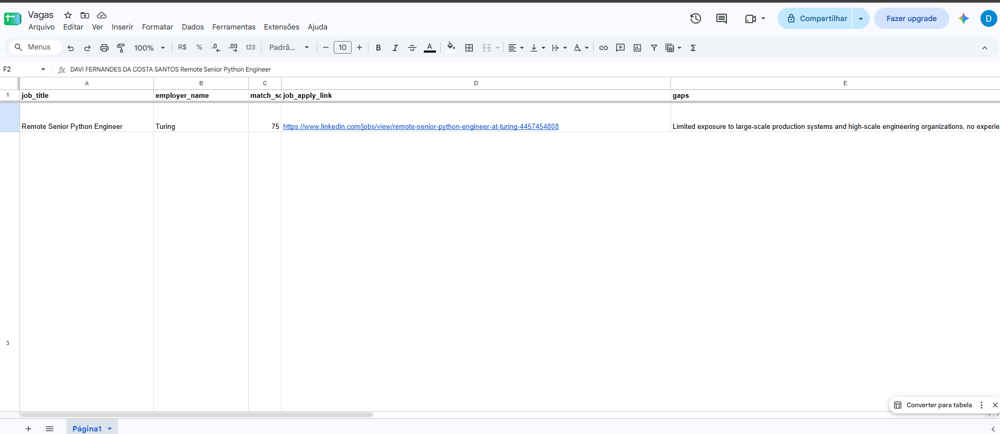
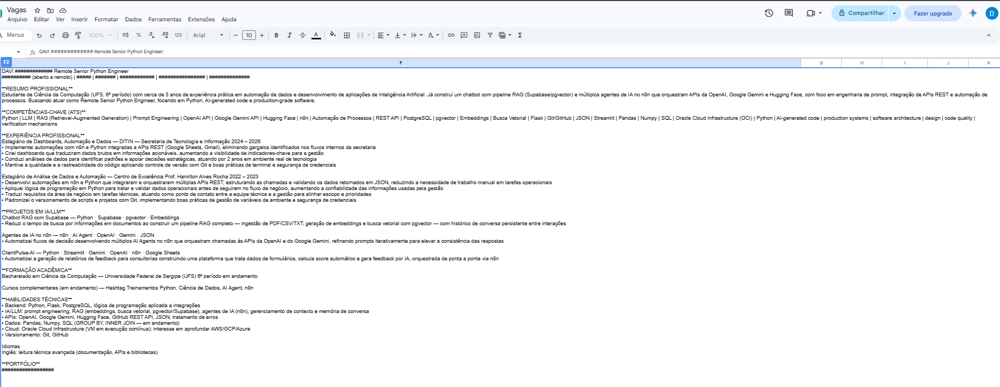
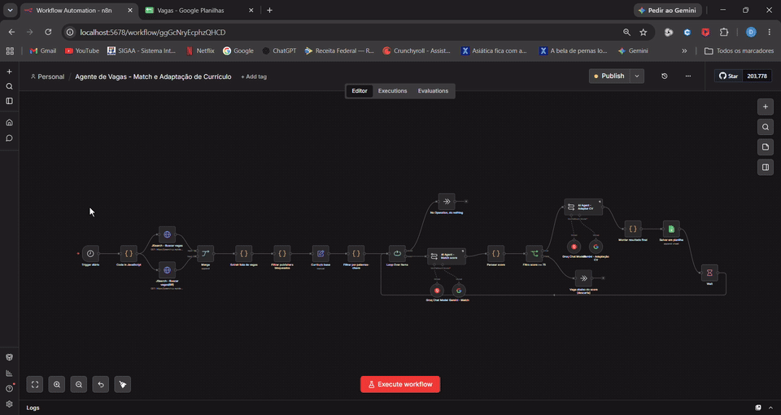
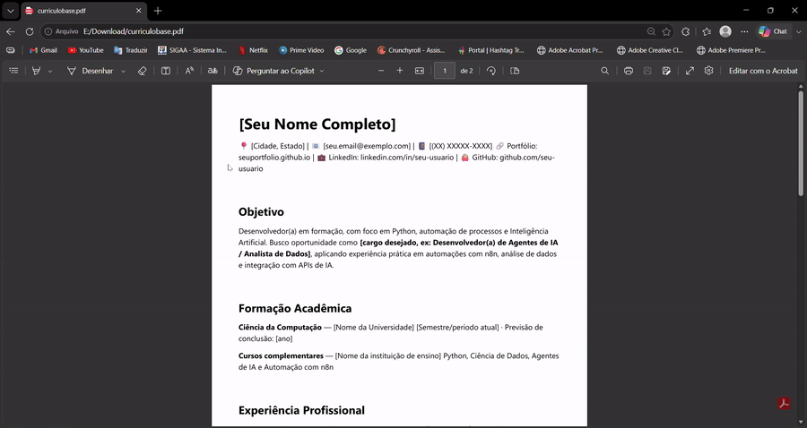

# JobMatch-AI

Sistema inteligente para automação da busca e análise de oportunidades profissionais, utilizando **n8n** e **Inteligência Artificial Generativa**.

O projeto automatiza a descoberta de vagas, estrutura os dados das oportunidades, compara os requisitos com um currículo base, calcula um **Match Score**, identifica lacunas de habilidades (*skills gap*) e gera uma versão personalizada do currículo para as vagas com maior aderência.



---

## 📑 Sumário

- [Sobre o projeto](#sobre-o-projeto)
- [Demonstração](#demonstração)
- [Fluxo da solução](#fluxo-da-solução)
- [Arquitetura](#arquitetura)
- [Principais funcionalidades](#principais-funcionalidades)
- [Match Score](#match-score)
- [Adaptação do currículo](#adaptação-do-currículo)
- [Resultado](#resultado)
- [Regras de negócio](#regras-de-negócio)
- [Tecnologias utilizadas](#tecnologias-utilizadas)
- [Estrutura do projeto](#estrutura-do-projeto)
- [Objetivo profissional](#objetivo-profissional)
- [Autor](#autor)

---

## Sobre o projeto

Buscar vagas manualmente, analisar requisitos e adaptar o currículo para cada oportunidade consome bastante tempo e nem sempre é feito com consistência.

O **JobMatch-AI** foi desenvolvido para automatizar esse processo, combinando automação de workflows, APIs, Inteligência Artificial Generativa e armazenamento estruturado — transformando uma busca manual em um fluxo automatizado de análise e preparação para candidatura.

---

## Demonstração

**Google Sheets — registro das oportunidades e CV Adaptado pelo Sistema**




**Funcionamento e teste com currículo Ficticio**




---

## Fluxo da solução

```
Schedule Trigger
      ↓
Busca de vagas
      ↓
Extração dos dados
      ↓
Filtragem das oportunidades
      ↓
Currículo base
      ↓
IA — Análise de compatibilidade
      ↓
Match Score
      ↓
Filtro de oportunidades
      ↓
IA — Adaptação do currículo
      ↓
Google Sheets
```

---

## Arquitetura

```
                        JobMatch-AI
                            │
          ┌─────────────────┼─────────────────┐
          ↓                 ↓                 ↓
      Automação             IA               Dados
          │                 │                 │
         n8n               LLM          Google Sheets
          │                 │
          ↓                 ↓
        APIs           Match Score
          │                 │
          └────────┬────────┘
                    ↓
           Currículo adaptado
```

---

## Principais funcionalidades

- Busca automatizada de oportunidades
- Integração com API de vagas
- Extração e estruturação dos dados
- Filtragem de oportunidades
- Análise de compatibilidade com o currículo
- Cálculo de Match Score
- Identificação de gaps de habilidades
- Seleção automática das vagas mais aderentes
- Adaptação do currículo utilizando IA Generativa
- Registro estruturado das oportunidades
- Armazenamento dos resultados no Google Sheets

---

## Match Score

Cada oportunidade é analisada considerando a compatibilidade entre os requisitos da vaga e o currículo base, levando em conta:

- Linguagens
- Tecnologias
- Ferramentas
- Competências
- Experiências
- Projetos
- Requisitos da oportunidade
- Palavras-chave

Vagas que atingem o percentual mínimo configurado seguem para a etapa de adaptação do currículo.

---

## Adaptação do currículo

Após a aprovação pelo Match Score, a oportunidade é encaminhada para um agente de IA responsável por adaptar o currículo, priorizando:

- Palavras-chave da vaga
- Competências relevantes
- Tecnologias solicitadas
- Projetos relacionados
- Experiências compatíveis

> ⚠️ O sistema **não** inventa experiências, cargos ou competências — a adaptação é feita exclusivamente com base no currículo real do usuário.

---

## Resultado

As oportunidades processadas são organizadas em uma estrutura contendo:

- Nome da vaga
- Empresa
- Link da oportunidade
- Match Score
- Skills gap
- Currículo adaptado

Os resultados são registrados no Google Sheets para facilitar o acompanhamento das candidaturas.

---

## Regras de negócio

- Oportunidades abaixo do Match Score mínimo são descartadas
- Somente vagas aprovadas seguem para a adaptação do currículo
- O currículo adaptado deve permanecer fiel ao currículo base
- Informações profissionais não devem ser inventadas
- Palavras-chave relevantes da vaga podem ser priorizadas
- Oportunidades processadas são armazenadas para acompanhamento

---

## Tecnologias utilizadas

| Categoria | Ferramentas |
|---|---|
| **Automação** | n8n, Workflow Automation |
| **Inteligência Artificial** | Generative AI, LLM, AI Agents |
| **APIs** | JSearch API, RapidAPI |
| **Dados** | Google Sheets |
| **Desenvolvimento** | Python, JSON, APIs REST |

---

## Estrutura do projeto

```
JobMatch-AI/
│
├── docs/
│   ├── arquitetura.md
│   ├── fluxo.md
│   ├── regras-negocio.md
│   ├── match-score.md
│   └── adaptacao-curriculo.md
│
├── images/
│   ├── workflow-principal.png
│   ├── google-sheets.png
│   ├── match-score.png
│   └── curriculo-adaptado.png
│
├── gifs/
│   └── demo.gif
│
├── workflows/
│   └── jobmatch-ai.json
│
├── prompts/
│   ├── match-job.txt
│   └── adaptar-curriculo.txt
│
├── data/
│   └── exemplo-vagas.csv
│
├── .env.example
├── .gitignore
├── LICENSE
├── README.md
└── requirements.txt
```

---

## Objetivo profissional

O projeto foi desenvolvido como estudo prático de:

- Automação de processos
- Integração entre APIs
- Inteligência Artificial Generativa
- Agentes de IA
- Análise semântica
- Processamento de dados
- Automação de workflows
- Personalização de informações
- Integração com ferramentas externas

---

## Autor

**Davi Santos**
Ciência da Computação | Python | IA Generativa | Automação | Dados | n8n

[](https://davisantos-23.github.io/)
[](https://linkedin.com/in/davisantos23dev)
[](mailto:davi.fernandescs21@gmail.com)